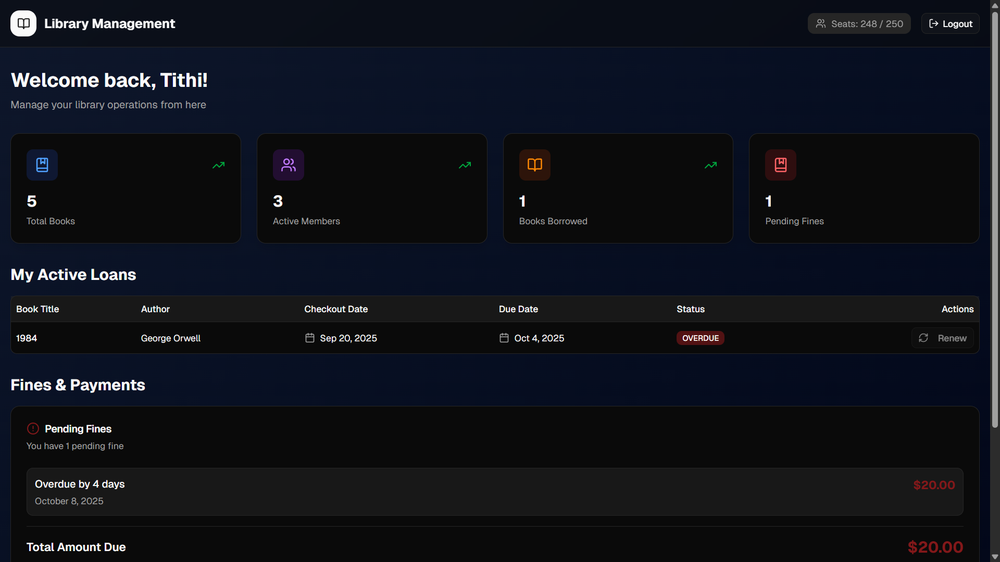
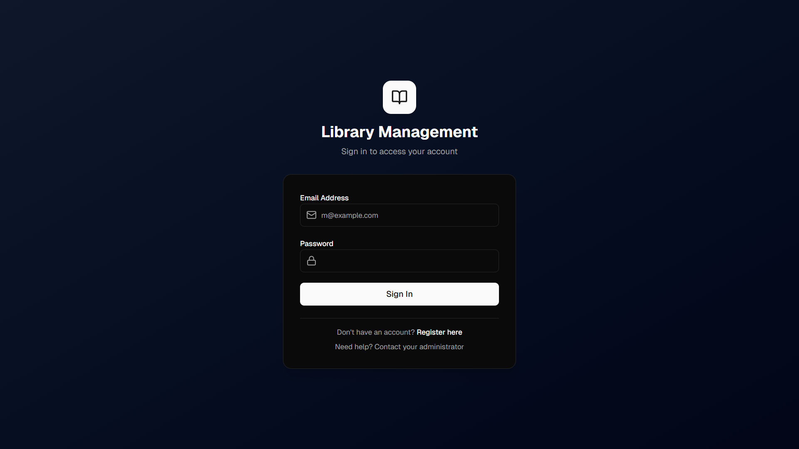
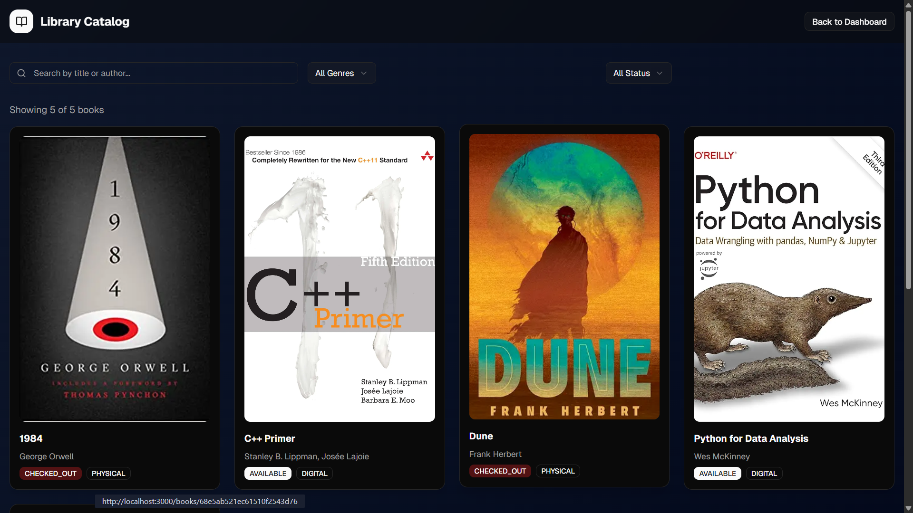
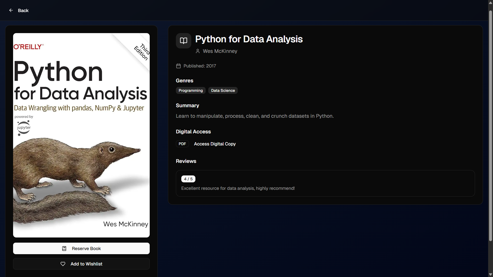

# 📚 Library Management System - Student Portal

<div align="center">
  
</div>

<br>

A modern, full-stack web application designed to serve as the student-facing portal for a comprehensive library management system. Built from the ground up with a scalable monorepo architecture, this project provides a seamless and feature-rich experience for students to interact with their library.

-----

## ✨ Features

This portal is packed with features designed for a great user experience:

* **Secure Authentication:** Complete JWT-based authentication flow (Register, Login, Logout) with password hashing (`bcrypt`) and secure HttpOnly cookies.
* **Protected Routes:** Robust middleware ensures that only authenticated users can access sensitive pages and APIs.
* **Dynamic Student Dashboard:** A central hub for students to get an at-a-glance overview of their library activity, including:
  * Real-time stats on total books, members, and seat availability.
  * Personalized stats for their current loans and pending fines.
  * Detailed tables showing all active loans and outstanding fines.
* **Interactive Book Catalog:**
  * Browse the entire library collection in a beautiful, responsive grid.
  * Live search by book title or author with debouncing for performance.
  * Filter books by genre and availability status.
  * Pagination to handle large collections.
* **Detailed Book View:** A dedicated page for each book, showing its cover, summary, author, ratings, and current status.
* **User Actions:**
  * **Wishlist:** Add or remove books from a personal wishlist.
  * **Loan Renewal:** Request to renew an active loan directly from the dashboard.
* **Dedicated Profile & Wishlist Pages:** Separate, protected pages for users to view their profile details and manage their wishlist.
* **Modern UI/UX:** Built with **shadcn/ui** and **Tailwind CSS**, featuring a stunning dark/light mode, toast notifications for user actions, and thoughtful loading/empty states.

-----

## 📸 Screenshots

| Login Page                                    | Dashboard                                     |
| --------------------------------------------- | --------------------------------------------- |
|  |  |
| **Book Catalog** | **Book Detail Page** |
|  |  |

-----

## 🛠️ Tech Stack & Architecture

This project is built using a modern, type-safe, and scalable technology stack.

* **Framework:** [Next.js](https://nextjs.org/) (App Router)
* **Language:** [TypeScript](https://www.typescriptlang.org/)
* **Database:** [MongoDB](https://www.mongodb.com/) with [Mongoose](https://mongoosejs.com/)
* **Styling:** [Tailwind CSS](https://tailwindcss.com/)
* **UI Components:** [shadcn/ui](https://ui.shadcn.com/)
* **Authentication:** [bcrypt.js](https://www.google.com/search?q=https://github.com/dcodeIO/bcrypt.js) for hashing, [jose](https://github.com/panva/jose) for JWTs
* **Architecture:** `pnpm` Monorepo managed with [Turborepo](https://turbo.build/repo)

### Project Structure

The monorepo is organized into `apps` and `packages` for clean separation of concerns:

* `apps/web`: The main Next.js application (Student Portal).
* `apps/admin`: A placeholder for the future Admin Portal.
* `packages/database`: Contains all Mongoose schemas, the database connection utility, and the seeder script.
* `packages/ui`: Contains shared React components built with `shadcn/ui`.
* `packages/eslint-config` & `packages/typescript-config`: Shared configurations for linting and TypeScript across the monorepo.

-----

## 🚀 Getting Started

Follow these steps to get the project up and running locally.

### Prerequisites

* Node.js (v20 or higher)
* `pnpm` (v10 or higher)
* A MongoDB database instance (you can get a free one from [MongoDB Atlas](https://www.mongodb.com/cloud/atlas/register))

### Installation & Setup

1. **Clone the repository:**

   ```bash
   git clone https://github.com/gargprachi343/minorproject.git
   cd minorproject
   ```

2. **Install dependencies:**

   ```bash
   pnpm install
   ```

3. **Set up environment variables:**

   Create a file named `.env` in the root of the project and add the following variables:

   ```env
   MONGODB_URI="your_mongodb_connection_string"
   JWT_SECRET="your_super_secret_key_for_signing_tokens"
   ```

4. **Seed the database:**

   This command will populate your database with sample users, books, loans, and fines.

   ```bash
   pnpm db:seed
   ```

5. **Run the development server:**

   ```bash
   pnpm dev
   ```

   The application will be available at `http://localhost:3000`.

### Login Credentials for Testing

After seeding the database, you can use the following credentials to log in:

* **Email:** `prachi@example.com`
* **Password:** `password123`

> **Note for Testers:** For ease of testing during the development of the admin panel, the password validation on the login route is currently bypassed. You can log in with a correct email and **any** password. **This is a temporary measure and must be reverted before production.**

-----

## 🔮 Future Roadmap

This project has a solid foundation, but there's always more to build\! Here are some potential next steps:

* **Build the Admin Portal:** Implement the `apps/admin` application for librarians to manage books, users, and loans.
* **Implement "Reserve Book":** Complete the functionality for a student to reserve a book that is currently checked out.
* **Advanced State Management:** Integrate a library like **Zustand** to manage global state (e.g., user data) more efficiently.
* **Automated Testing:** Add a testing suite using **Vitest** for the backend APIs and **Playwright** for end-to-end frontend tests.
* **Deployment:** Deploy the application to a platform like [Vercel](https://vercel.com/).

-----

## 📄 License

This project is open source and available under the [MIT License](LICENSE).

## 🤝 Contributing

Contributions, issues, and feature requests are welcome! Feel free to check the [issues page](https://github.com/gargprachi343/minorproject/issues).

## 👤 Author

**Prachi Garg**

* GitHub: [@gargprachi343](https://github.com/gargprachi343)
* Repository: [minorproject](https://github.com/gargprachi343/minorproject)

-----

⭐️ If you found this project helpful, please give it a star!
